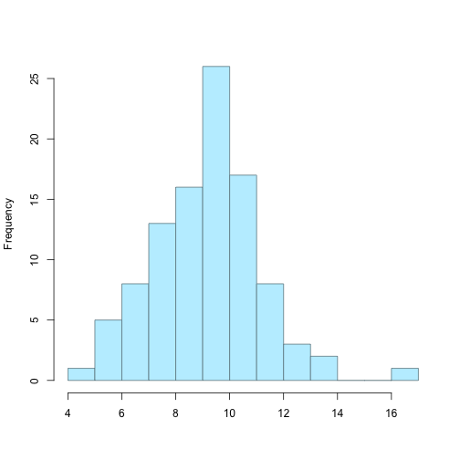

An app for illustrating the normal distribution
========================================================
author: Paolo Eusebi
date: 

Outline
========================================================

- The normal distribution
- The app
- Resources

The normal distribution
========================================================

In probability theory, the normal (or Gaussian) distribution is a very commonly occurring continuous probability distribution.

Normal distributions are extremely important in statistics and are often used in the natural and social sciences for real-valued random variables whose distributions are not known

The app
========================================================

The shiny app is available at: https://paoloeusebi.shinyapps.io/normal_app/

The shiny app is for illustrating the normal distribution. The empirical distribution of the random draws from a normal density is depicted in a histogram. The sample size, the mean and the standard deviations are supplied by the user.

The app
========================================================
Let's suppose to type in 9 for the mean, 2 for the standard deviations and 100 random draws, you will see an histogram:

 

Resources
========================================================

The shiny app is available at: https://paoloeusebi.shinyapps.io/normal_app/

Wikipedia page about the Normal distribution http://en.wikipedia.org/wiki/Normal_distribution

